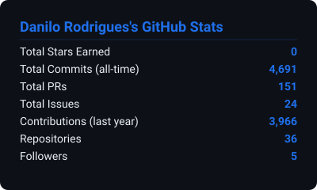
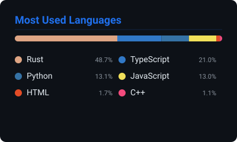
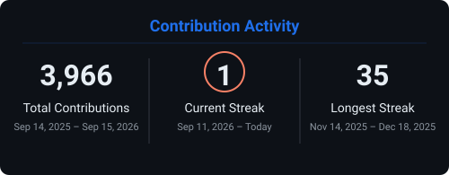

<div align="center">

<!-- HEADER -->


<!-- LANGUAGE TOGGLE -->
<details>
<summary>🇧🇷 <b>Versão em Português</b></summary>
<br>

```
Desenvolvedor backend focado em automação e sistemas de alta performance.
Trabalho com Node.js e Rust, construindo bots, APIs e infraestrutura
que roda 24/7. Apaixonado por resolver problemas complexos com código limpo.
```

**Especialidades:** Bots de automação · APIs em tempo real · Sistemas distribuídos · Trading bots · DevOps

</details>

<br>

```
Backend developer focused on automation and high-performance systems.
I work with Node.js and Rust, building bots, APIs, and infrastructure
that runs 24/7. Passionate about solving complex problems with clean code.
```

</div>

---

<h2 align="center">⚡ Tech Stack</h2>

<div align="center">

**Most Used**


---

**Languages**


</div>

---

<h2 align="center">📊 Stats</h2>

<div align="center">

  &nbsp;&nbsp;

</div>

<br>

<div align="center">

</div>


---

<div align="center">

**📫 Get in touch**

[](mailto:daanrod93@gmail.com)
[](https://linkedin.com/in/daanrod93)

</div>


